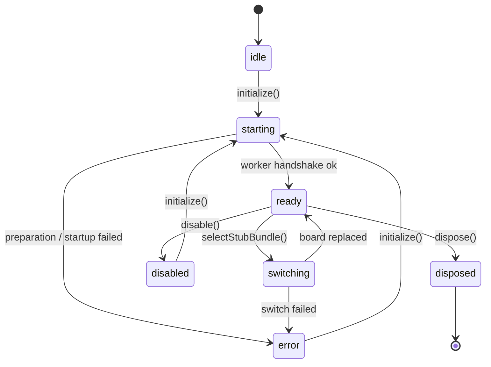

# Type-Checking Integration

This document describes ViperIDE's application-owned type-checking integration
for maintainers reviewing or extending the feature. It covers the public
integration points ViperIDE exposes around the reusable
[`@mp-typing/lsp-client`](https://www.npmjs.com/package/@mp-typing/lsp-client)
and [`@mp-typing/pyright-worker`](https://www.npmjs.com/package/@mp-typing/pyright-worker)
packages. The reusable client, worker, transport, and LSP plugin APIs are
documented with those packages; this document does not duplicate them and
instead explains how ViperIDE consumes them.

## Ownership boundary

ViperIDE owns everything specific to the product: the settings UI, editor and
device lifecycle, the mirrored Python workspace, board selection, diagnostics
and status presentation, and the bundled Viper tools stubs. The reusable
packages own the worker runtime, JSON-RPC/LSP protocol, CodeMirror plugin, and
worker transport control protocol.

The single seam between the two is `TypecheckingService`, an
application-level adapter that holds one worker runtime and injects
ViperIDE-supplied hooks into the reusable client. The service contains no DOM
dependencies; hosts inject editor and runtime callbacks.

## Module layout

| Module | Responsibility |
|---|---|
| `src/typechecking/typechecking.js` | Wires the reusable client factories into a single shared `TypecheckingService` instance and exposes the stub manifest loader. |
| `src/typechecking/typechecking_service.js` | The integration adapter: runtime lifecycle, editor bindings, workspace mirror, board switching, stub-package management, and status snapshots. |
| `src/typechecking/typechecking_assets.js` | Resolves worker/runtime/stub asset URLs from the copied npm package and bundled Viper tools wheel. |
| `src/typechecking/typechecking_settings.js` | Pure functions that normalize ViperIDE settings into reusable-client runtime config and catalog selections. |
| `src/typechecking/typechecking_status.js` | Pure functions that turn a service snapshot into status text and diagnostic summaries. |
| `src/typechecking/typechecking_workspace.js` | Reads device Python files and reconciles them into the workspace mirror. |

The shared instance is constructed once in `typechecking.js`:

```js
export const typechecking = new TypecheckingService({
  createLSPClient,
  createLSPPlugin,
  notifyDocumentChange,
  notifyDocumentClose,
  switchBoard,
  prepareRuntime: config => typecheckingAssets.prepare(config),
})
```

The application binds its editor integration once at startup:

```js
typechecking.setEditorIntegration(configureTypechecking)
```

## Lifecycle

`TypecheckingService` moves through a small set of statuses. Every transition is
published to `onStatusChange` listeners.



- `initialize(config)` starts the worker and LSP handshake. Concurrent calls are
  coalesced, and a call while `ready` resolves immediately with the current
  snapshot. `config` is passed through `prepareRuntime` to resolve the worker
  URL and selected stub bundle.
- `disable()` stops type checking but retains editor bindings and mirrored files
  so the service can be re-initialized cheaply.
- `restartRuntime(configOverrides)` replaces the runtime while preserving
  configuration and editor bindings. It is used after installing or clearing
  stub packages.
- `dispose()` permanently closes the service and releases worker resources and
  listeners. ViperIDE calls this only on real page unload, not on bfcache
  `pagehide`, so a restored page keeps its worker.

A monotonic generation guard prevents a late worker handshake from surviving
disposal or re-initialization.

## Editor binding

Editors are bound as tabs load and unbound as they close. Binding is safe before
initialization: the document is opened when the runtime becomes ready.

```js
document.addEventListener('editorLoaded', event => {
  if (!supportsTypechecking(event.detail.fn, event.detail.editor.state.readOnly)) return
  typechecking.bindEditor(event.detail.editor, event.detail.fn)
    .catch(err => report('Unable to enable type checking for this file', err))
})

document.addEventListener('tabClosed', event => {
  const closed = getEditorFromElement(event.detail.editorElement)
  if (closed) typechecking.unbindEditor(closed)
})
```

- `bindEditor(editorView, path)` mirrors the current buffer, records the binding,
  and — when ready — opens the LSP document and installs the CodeMirror
  extensions through the host `configureEditor` callback. It returns the encoded
  `file:///workspace/...` URI.
- `changeEditor(editorView, content)` publishes the complete current document to
  Pyright. ViperIDE calls it from the editor update handler so completion and
  hover always see current text.
- `unbindEditor(editorView)` closes the LSP document and removes the editor
  extensions.

Document URIs live below `file:///workspace`. Paths are validated and rejected
if they contain empty, `.`, or `..` segments.

## Device and workspace synchronization

Filesystem events keep the mirror aligned with the file tree:

```js
document.addEventListener('fileRenamed', e => typechecking.renamePath(e.detail.old, e.detail.new))
document.addEventListener('fileRemoved', e => typechecking.removePath(e.detail.path))
document.addEventListener('dirRemoved', e => typechecking.removePath(e.detail.path, true))
```

- `renamePath` / `removePath` update the mirror and any open editors.
- `hydrateWorkspace(files)` merges `.py` files into the mirror without removing
  anything.
- `replaceWorkspace(files, { preservePaths })` reconciles the mirror to a
  complete snapshot. Open editor buffers (including unsaved edits) always win
  over device content, and `preservePaths` protects files that could not be read
  during an incomplete device read.

When workspace-scope diagnostics are enabled, ViperIDE reads the connected
device's Python files and reconciles them through `replaceWorkspace`:

```js
await syncDevicePythonWorkspace({
  enabled: getSetting('typecheck-enabled'),
  scope: getSetting('typecheck-scope'),
  raw, fsCache, isSpecialPath,
  replaceWorkspace: (files, options) => typechecking.replaceWorkspace(files, options),
})
```

Device reads are sequential because raw-mode commands cannot overlap, and
unreadable files are preserved rather than dropped.

Board selection is driven by device metadata. On `deviceConnected`, ViperIDE
queues a selection that resolves the target from `sys.platform` (MicroPython) or
descriptive identity fields (CircuitPython):

- `selectDevice(devInfo)` selects stubs inferred from device metadata.
- `selectStubBundle(boardId)` restarts Pyright with a specific manifest bundle,
  rebinding existing editors and mirrored files.

Type checking is intentionally independent of the device transport and stays
alive across reconnects.

## Settings and reconfiguration

`typechecking_settings.js` holds pure conversion functions and does not touch the
service. ViperIDE settings map to reusable-client runtime config through:

- `typecheckingRuntimeConfig(settings)` and
  `catalogTypecheckingRuntimeConfig(settings)` — build `extraPaths`,
  `diagnosticMode`, `typeCheckingMode`, `typeshedPath`, and the board/stub
  package selection. ViperIDE always sets `typeshedPath` to
  `/typeshed-micropython` so the client uses MicroPython stdlib stubs instead of
  CPython typeshed.
- `normalizeTypecheckingMode` / `normalizeTypecheckingScope` /
  `normalizeTypecheckingBoard` — clamp persisted values to supported sets.
- `resolveTypecheckingBoard(board, devInfo)` — resolve an `auto` board to the
  connected device target.
- `typecheckingStubPreferences` / `typecheckingAutodetectFallback` — map device
  metadata to catalog family/port/version/board and surface autodetect warnings.
- `parseStubPackageSpecifier(value)` — validate a PyPI name plus optional version
  constraint before installation.

Reconfiguration (mode, scope, board, or device change) restarts the runtime with
`restartRuntime(currentTypecheckingConfig())` when ready, or `initialize` when
not. Application code serializes these operations so overlapping settings changes
apply in order.

## Diagnostics and status access

The service exposes state only through immutable snapshots.

- `onStatusChange(listener)` subscribes to lifecycle, diagnostics, and workspace
  snapshots and invokes the listener immediately. It returns an unsubscribe
  callback.
- `snapshot()` returns the current `TypecheckingSnapshot` with copied `Map`
  containers. Diagnostic objects and the `client`/`transport` references are
  shared and must be treated as read-only.

`typechecking_status.js` derives presentation from a snapshot:

- `collectDiagnosticEntries(diagnosticStatus)` flattens and deduplicates
  Pyright diagnostics.
- `typecheckingStatusPresentation(snapshot, enabled)` and
  `renderTypecheckingStatus(...)` produce the status label, tooltip, and busy
  state, including the runtime source (remote, cached last-known-good, or
  bundled) and count of skipped incompatible runtimes.

The diagnostics panel separately reads CodeMirror's merged lint state so it can
combine Pyright with Ruff and mpy-cross results; the service snapshot carries the
Pyright contribution only.

## Package and asset loading

`TypecheckingAssets.prepare(config)` resolves the worker URL, runtime manifest
options, board stub bundle, and any extra stub archives from the worker package
assets copied into the ViperIDE build. Key behavior:

- The copied npm worker URL is always supplied as the bundled offline fallback.
  When a `runtimeManifestUrl` is configured, the reusable client selects a
  compatible immutable runtime at startup and falls back to the bundle when none
  is compatible.
- The bundled Viper tools wheel is injected as an `extraStubArchives` entry when
  `viperToolsStubs` is enabled. Its filename, size, and SHA-256 are build-time
  constants; the archive is restricted to its own origin.
- `loadManifest()` loads and memoizes the stub manifest; failed loads are not
  cached and may be retried.

Runtime stub packages can also be installed from PyPI at runtime:

- `installStubPackage(name, versionSpecifier)` installs a wheel and restarts
  Pyright automatically.
- `clearStubPackages(name?, version?)` clears cached stubs and restarts only when
  the worker reports a restart is required.
- `listStubPackages`, `getStubPackageCatalog`, and `listInstalledStubPackages`
  are read-only catalog queries; they wait for and retry across an in-progress
  runtime replacement rather than failing.

## Failure behavior

- Preparation, worker startup, or editor rebinding failures move the service to
  `error` with the originating error retained in the snapshot. The status tooltip
  instructs the user to toggle type checking in Settings to retry, and
  re-initialization is permitted from `error`.
- Board switch failures close the runtime and surface as `error`.
- Editor bindings that the host `configureEditor` callback rejects are removed,
  and `bindEditor` / `rebindEditor` throw so the caller can report which files
  could not be type-checked.
- Device workspace read errors are logged per file and the affected paths are
  preserved in the existing mirror; a single unreadable file does not abort the
  sync.
- Stub-package management requires a ready runtime; queries throw a clear error
  when the service is not ready.

## Related documentation

- Reusable client, worker, transport, and CodeMirror plugin APIs:
  `@mp-typing/lsp-client` and `@mp-typing/pyright-worker` package READMEs.
- ViperIDE local development workflow: [Development](Development.md).
- Advanced-mode settings that expose stub-package management:
  [Advanced Mode](Advanced-Mode.md).
